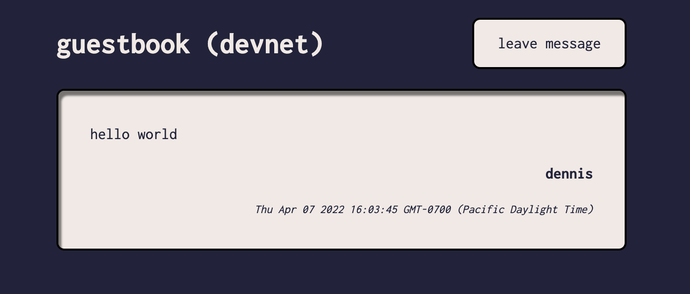

Hi, welcome to my guestbook. Feel free to reuse.



# What is it?

Solana guestbook is a simple on chain program that stores the message of any given user (wallet).

Any person can connect their wallet and leave a message (max size 280 bytes) as well as an optional name (max size 32 bytes). The message and name will be stored on chain. I currently query all messages and display them on [here](https://hi.dennisantela.com). Leave a message if you'd like to solidify yourself on my program / website 😄

This repo includes the rust / anchor program (smart contract), a deploy / upgrade script and a client interacting with the program. It also automatically airdrops a user some devnet SOL if the wallet has no SOL balance. The client is written with Next.js (React / TypeScript).

- [Demo](https://hi.dennisantela.com)
  - This demo is currently only on devnet, so interacting with it won't cost you any sol.
  - Don't trust me? Create a brand new wallet and it'll even automatically airdrop you some devnet SOL on message submission.
  - _Feel free to leave a message in my guestbook_

# How to deploy the program on devnet

wanna build your own program derivative? Follow the instructions below to deploy your own version.

create a wallet keypair in the root directory and name it `wall-wallet-dev.json`. Make sure you've got solana installed on your machine.

```
solana-keygen new --outfile ./wall-wallet-dev.json
```

you will use this keypair to deploy the program so make sure it has a few sol. For the current program I needed to spend just above 2 SOL on devnet.

```
solana airdrop 2 -k ./wall-wallet-dev.json
```

check balance

```
solana balance -k ./wall-wallet-dev.json
```

install packages and make sure program passes your tests (located in ./tests).

```
yarn install
anchor test
```

if all passes, run the deploy script.

```
yarn deploy-devnet
```

if you later want to commit changes to your program, you can run the upgrade script.

```
yarn upgrade-devnet
```

enjoy!

# How to run the client locally?

run the following in the root directory to add the program id to your local environment varibables.

```
echo NEXT_PUBLIC_PK=8jERC5W8gmD634eqkLL1oCLPrVvJycxVyCWJhxf3uXvV > ./app/.env.local
```

since this is not a secret key, you don't need to store it as an env variable and can instead declare it in the `./app/utils/constants.ts` or wherever you'd like.

next, serve the app locally. (port 3000 by default)

```
cd app
yarn install
yarn dev
```

# Credits

As I started writing the program I stumbled upon this neat [blog implementation](https://github.com/DougAnderson444/solblog) from @DougAnderson444 and I ended up taking a bunch inspiration from it. Also shoutout to my team @bucket-dao and especially @jshjshiohaha.
